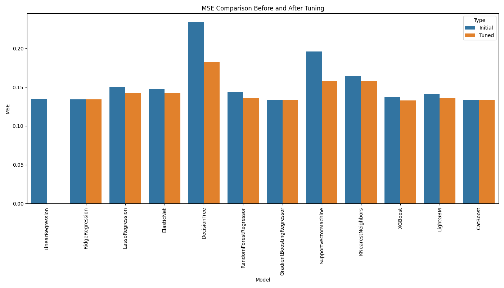

# Customer Churn Prediction Model

The goal of this project is to develop a machine learning model capable of predicting which customers are likely to leave the company. By accurately forecasting customer churn, the company can implement targeted retention strategies, improve customer satisfaction, and ultimately enhance profitability.
## Table of Contents

- [Project Structure](#project-structure)
- [Features](#features)
- [Installation](#installation)
- [Usage](#usage)
- [Results](#results)
- [Contributing](#contributing)
- [License](#license)
- [Contact](#contact)

## Project Structure

- `catboost_info/`: Information and log files related to the CatBoost model.
- `data/`: Directory containing the datasets.
- `output/`: Project outputs, result files, and graphs.
  - `mse_comparison_plot.png`: Comparison plot of different models.
  - `result.csv`: File containing the prediction results.
- `.gitignore`: File to exclude unnecessary files from being included in Git.
- `config.py`: Configuration file used throughout the project.
- `data_loader.py`: Helper classes for loading and processing data.
- `data_preprocessor.py`: Functions and classes for data preprocessing.
- `feature_selector.py`: Code for feature selection.
- `hyperparameter_tuner.py`: Functions for hyperparameter optimization.
- `main.py`: Main execution file of the project.
- `model_trainer.py`: Code for training and evaluating models.
- `research.py`: Code for research and model experiments.
- `visualization.py`: Code for visualizing data and results.

## Features

- **Data Loading and Processing:** Loading, preprocessing, and analyzing data.
- **Feature Selection:** Selecting the best features for the model.
- **Model Training:** Training models with various algorithms like CatBoost.
- **Hyperparameter Optimization:** Adjusting hyperparameters for optimal model performance.
- **Visualization:** Graphically presenting the model results.

## Installation

To run the project, follow these steps:

### Requirements

- Python 3.x
- You can use the `requirements.txt` file to install the necessary Python packages (if available):

```bash
pip install -r requirements.txt
```

### Running the Project

1. Clone the repository:

   ```bash
   git clone https://github.com/Furk4nBulut/Salary-Prediction.git
   cd Salary-Prediction
   ```

2. Load and preprocess the data:

   ```bash
   python data_preprocessor.py
   ```

3. Train the model:

   ```bash
   python model_trainer.py
   ```

4. Evaluate and visualize the results:

   ```bash
   python visualization.py
   ```

## Results

- **MSE Comparison:** The performance of different models is visualized in `output/mse_comparison_plot.png`.
- **Prediction Results:** The predicted salaries are stored in `output/result.csv`.


## Contributing

If you would like to contribute to this project, please open an `issue` first. Any contributions or suggestions are welcome.

## License

This project is licensed under the MIT License. See the `LICENSE` file for more details.

## Contact

If you have any questions about this project, feel free to reach out:

- **Email:** [furkanbtng@gmail.com](mailto:furkanbtng@gmail.com)
- **GitHub:** [Furk4nBulut](https://github.com/Furk4nBulut)****